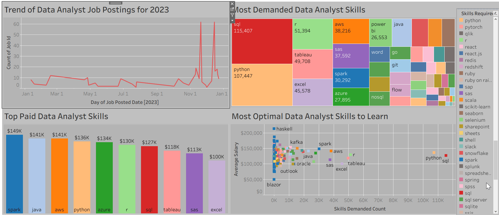

# Most Optimal Data Analyst Skills to Learn

# Introduction
This dashboard dives deep into the evolving landscape of data analyst job postings, the most in-demand skills, and the salary potential of top technical proficiencies. By analyzing data from 2023, it visualizes trends in job posting frequency, highlights which skills employers are searching for most, and identifies which technical competencies command the highest pay. The “Optimal Skills” scatter plot reveals where the sweet spot lies between skill demand and salary, helping aspiring or advancing data analysts strategically prioritize their learning. Together, these visuals provide actionable insights for anyone navigating the data job market or designing data analytics curricula, offering a clear, compelling picture of what it takes to stand out and cash in, as a data professional.
### Tableau File and Link
File: [Most_optimal_data_analyst_skills](Most_optimal_data_analyst_skills_to_learn.twb)

Link: [Most_optimal_skills](https://public.tableau.com/views/Most_optimal_data_analyst_skills_to_learn/Dashboard1?:language=en-US&:sid=&:redirect=auth&:display_count=n&:origin=viz_share_link)

# Data Source and SQL Queries
The data used in this project was derived by running SQL queries on data found in "ProjectSQL" repository.

Data: [Original_data_source_by_luke](https://drive.google.com/drive/folders/1moeWYoUtUklJO6NJdWo9OV8zWjRn0rjN)

CVS files: [SQL_queries_csv](https://onedrive.live.com/?id=%2Fpersonal%2F2749f5080722ca24%2FDocuments%2FSQL%5Fqueries%5Fcsv&view=0)

SQL Queries: [Queries](Queries)

# Key Insights
* Data analyst job postings surged dramatically in late 2023, with two major spikes in November and December. This is a clear signal of cyclical or end-of-year hiring trends that aspiring analysts can capitalize on.
* SQL and Python are the most demanded skills for data analyst roles, with over 115,000 and 107,000 postings respectively in 2023, underscoring their essential place in any data analyst’s toolkit.
* Visualization and BI tools like Tableau and Power BI are also in high demand, but offer more moderate salary ranges, indicating they are valuable but best combined with programming or cloud skills for maximum earning potential.

* Spark, Java, AWS, and Python top the salary charts, commanding average salaries of $136K–$150K, highlighting that big data engineering and cloud skills open doors to the highest-paying opportunities.
* R, SQL, Tableau, and Excel also made the list for the top paid skills in this dataset.

* Optimal skills for aspiring data analysts center on Python, SQL, R, Tableau, Excel, and AWS, which combine strong market demand with robust salary potential, thus making them the smartest investment for building a versatile, future-proof analytics career.

# Tableau Skills Used
 * Connected and joined multiple datasets to create a unified data source for analysis.

* Applied filters to display the most relevant job titles and skills dynamically.

* Formatted numeric fields for readability, including currency with “k” notation for compact, professional visuals.

* Designed diverse charts, including bar charts, scatter plots, treemaps, and line graphs, to communicate key patterns effectively.

* Customized colors, gridlines, and background elements to enhance clarity and align with modern dashboard design best practices.

* Published the final dashboard to Tableau Public, enabling live, shareable, interactive insights.
# Conclusion
This project provides a comprehensive look into the skills that matter most for data analysts today, revealing where demand and compensation intersect to guide strategic career choices. By combining rigorous data preparation with engaging, interactive Tableau dashboards, this analysis turns complex job market dynamics into clear, actionable insights for aspiring and current data professionals alike. Beyond highlighting top-paying and most-demanded skills, it underscores the importance of pairing technical proficiency with storytelling capabilities, a combination that empowers data analysts not just to land a role but to thrive in it.
